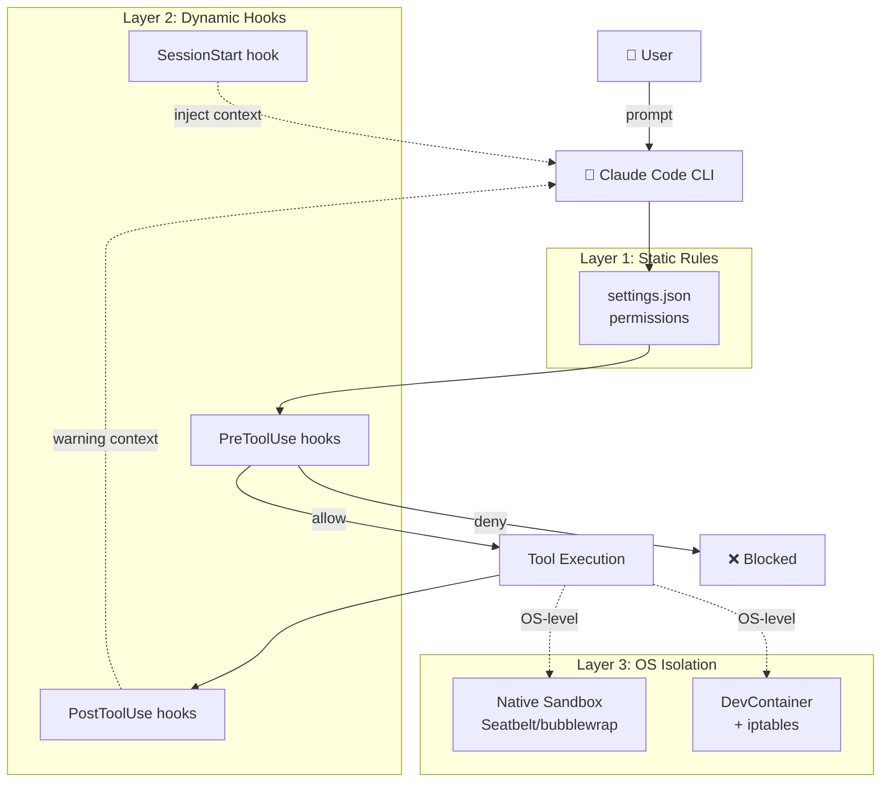

# Architecture — 設計思想

このテンプレが「なぜこの構造になっているか」を説明します。

## 🎯 設計原則

### 1. ガードレール硬め

開発者は **ミスをする**、Claude は **指示の解釈を誤る** ことがある、というのが前提。
**安全な失敗** を実現するため、複数層の防御を組み合わせる。

### 2. デフォルト Deny、必要時 Allow

「とりあえず全部許可」ではなく、**最小権限の原則**。必要が出てきたら `settings.local.json` で個別追加。

### 3. プロジェクト集約

`~/.claude/`（ユーザー設定）に依存しない。**プロジェクト内ですべて完結** することで:
- Claude Code Web でも動く
- 別マシン・別ユーザーでも同じ挙動
- チームメンバー間でルール統一

### 4. 透明性

すべてのフック・設定は **読める形** で書く。隠れた挙動を作らない。

### 5. 軽さ

CLAUDE.md は 60〜80行、各 hook は単一責任、コマンドは引数最小。**読めば動きが分かる**。

---

## 🏗️ 全体構造



---

## 📐 設計判断

### Q: なぜ `deny` だけでなく `hook` も使うのか？

**A**: Claude Code 本体の `deny` 機能には過去複数の不具合報告があるため（[Issue #6699](https://github.com/anthropics/claude-code/issues/6699) ほか）。`deny` で漏れても `hook` で止める **二重防御** にしている。

### Q: なぜ Bash の allow リストを細かく分けているのか？

**A**: `Bash(*)` ですべて許可する代わりに、`Bash(git status)`, `Bash(npm run lint)` のように個別許可することで、未知のコマンドは必ず確認が走る。

### Q: なぜ injection-scanner はブロックではなく警告なのか？

**A**: Prompt Injection は **未解決問題** で、false positive が必ず発生する。完全ブロックすると正常な作業も止まる。Claude 自身に「この内容を信用するな」と context で伝える **inform-the-AI** パターン（Lasso Security 推奨）が現実解。

### Q: なぜ CLAUDE.md を短くするのか？

**A**: 毎セッション読まれるためトークンコストが発生し、長すぎると **Claude の遵守率が下がる**（builder.io ガイド調べ）。手順書は Skills へ、長文は docs/ へ分割。

### Q: なぜ Web 系（WebFetch / WebSearch）はデフォルト deny なのか？

**A**: Prompt Injection の主要経路だから。`/deep-research` で必要なときだけ session で許可する設計。

### Q: なぜ Claude Code Web を主軸にするのか？

**A**: スマホ開発の最短経路。ローカルマシン不要・5分でセットアップ・GitHub 連携が自動。本テンプレは **プロジェクト集約** なので Web でも完全動作する。

### Q: なぜ MIT ライセンスか？

**A**: エコシステム全体の事実上の標準（12人気リポ中10がMIT）。商用利用・フォーク・プラグイン再配布を阻害せず、採用最大化。

---

## 🔄 ライフサイクル

### セッション開始時

```
1. claude 起動
2. ~/.claude/settings.json 読み込み（ユーザー設定）
3. .claude/settings.json 読み込み（プロジェクト設定）
4. .claude/settings.local.json 読み込み（個人設定）
5. → array 設定は結合（重複除去）、非 array は後勝ち
6. CLAUDE.md 階層読み込み（managed → user → project → local）
7. SessionStart hook 実行 → context 注入
8. ユーザー入力待ち
```

### ツール実行時

```
1. Claude がツール呼び出しを決定
2. permissions.deny マッチ → ❌ ブロック
3. PreToolUse hook 実行
   - exit 2 or permissionDecision: "deny" → ❌ ブロック
   - permissionDecision: "ask" → ユーザー確認
   - permissionDecision: "allow" → 確認なし実行
   - exit 0 (空) → 通常フローに戻る
4. permissions.allow マッチ → 確認なし実行
5. それ以外 → ユーザー確認
6. ツール実行
7. PostToolUse hook 実行
   - additionalContext で警告等を注入
8. Claude が結果を受け取って次のアクション決定
```

### セッション終了時

```
1. Stop hook 実行
2. SubagentStop hook 実行（該当時）
3. ログ保存（~/.claude/projects/<id>/）
```

---

## 🎨 設計トレードオフ

### Trade-off 1: 安全性 vs 開発体験

**選択**: 安全性寄り。`disableBypassPermissionsMode: "disable"` で bypass 不可。

**理由**: テンプレ利用者は最初はガードレールに引っかかってストレスを感じるかもしれない。が、慣れれば「**ブロックされる時点で問題のあるコマンド**」と気づける。開発体験を最大化したいなら `settings.local.json` で個別に allow を追加する設計。

### Trade-off 2: フル機能 vs 軽量

**選択**: フル機能（agents 6 + commands 5 + skills 3 + hooks 6 + DevContainer + 5 workflows）。

**理由**: 「全部入り」を提供して、ユーザーが不要なものを削るほうが、ゼロから足すより楽。`docs/customization.md` に削除手順あり。

### Trade-off 3: 公式準拠 vs 独自進化

**選択**: 公式準拠（`.claude/{commands,agents,skills,hooks}` 4層構造）。

**理由**: 公式が推奨し、12人気リポが同じ構造に収束しているため、エコシステムの他ツール（dotforge 等の監査ツール）とも互換性が保てる。

### Trade-off 4: 厳格 deny vs 柔軟性

**選択**: 厳格 deny（WebFetch / WebSearch はデフォルト deny）。

**理由**: Web 系は Prompt Injection の主要経路。必要なときだけ session で許可する方が安全。

---

## 🛣️ 今後の進化方向

### 短期

- [ ] `audit.sh` の 15 項目スコアリングを 30 項目に拡張
- [ ] `validate-settings.sh` を JSON Schema 検証に
- [ ] `examples/strict-managed-settings.json` を企業向け実例で複数用意
- [ ] mobile-development.md の音声入力 Tips 拡充

### 中期

- [ ] Plugin Marketplace 経由の配布
- [ ] `claude-code-router` 統合（モデル動的ルーティング）
- [ ] エディタ別 settings（Cursor, Windsurf, VS Code Insiders）

### 長期

- [ ] ハードウェアトークン（YubiKey 等）を使った真の bypass 禁止
- [ ] TLS インスペクション対応（custom proxy）
- [ ] 行動分析ベースの異常検知（過去セッションとの差分）

---

## 📚 参考リポ（リスペクト）

このテンプレは以下のプロジェクトから学びました:

- [anthropics/claude-code](https://github.com/anthropics/claude-code) — 公式 CLI と DevContainer の `init-firewall.sh` パターン
- [anthropics/claude-code-action](https://github.com/anthropics/claude-code-action) — GitHub Action とセキュリティドキュメント体系
- [scotthavird/claude-code-template](https://github.com/scotthavird/claude-code-template) — 4層構造の完全実装例（GitHub Template化）
- [luiseiman/dotforge](https://github.com/luiseiman/dotforge) — ガバナンス + 15項目監査スコアリング
- [lasso-security/claude-hooks](https://github.com/lasso-security/claude-hooks) — Prompt Injection スキャンパターン
- [CodyLunders/claude-code-hooks-library](https://github.com/CodyLunders/claude-code-hooks-library) — 60+ セキュリティフックライブラリ
- [SuperClaude_Framework](https://github.com/SuperClaude-Org/SuperClaude_Framework) — メタプログラミング設定フレームワーク
