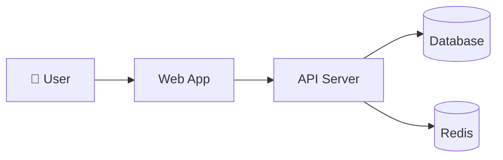

# Architecture

システム全体のアーキテクチャドキュメント。**[C4 Model](https://c4model.com/)** をベースに整理します。

## C4 の4階層

```
Level 1: System Context  — システムと外部の関係
Level 2: Container       — 大きなサブシステム
Level 3: Component       — Container 内のコンポーネント
Level 4: Code            — クラス図・データモデル
```

実用上は **Level 1-3** までで十分なことが多い。Level 4 は必要なときだけ。

## ファイル構成

```
docs/architecture/
├── README.md                  # このファイル
├── c1-system-context.md       # Level 1
├── c2-containers.md           # Level 2
├── c3-<area>-components.md    # Level 3（領域別）
└── diagrams/                  # PlantUML / Mermaid 図のソース
```

## いつ書くか

- 新規プロジェクト立ち上げ時
- 大きなアーキテクチャ変更時（ADR と連動）
- 新メンバーのオンボーディングが必要なとき

## 図の書き方

このテンプレでは **Mermaid** を推奨（GitHub でそのまま描画される）:



詳細図が必要な場合は [PlantUML](https://plantuml.com/) や [Structurizr](https://structurizr.com/) も使用可。

## 命名

- `c1-system-context.md`: 単一
- `c2-containers.md`: 単一
- `c3-<area>-components.md`: 領域別（`c3-auth-components.md`, `c3-payment-components.md` 等）
