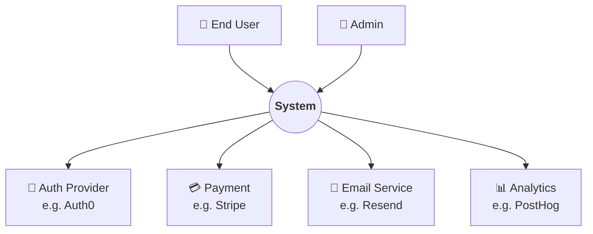

# C1: System Context

> このプロジェクトと外部の関係。**「誰が使うか」「何と繋がるか」** を1枚図にする。

## 図



## Actors

| Actor | Role | 主要なユースケース |
|-------|------|------------------|
| End User | サービス利用者 | サインアップ、購入、利用 |
| Admin | 運用者 | 顧客対応、データ管理 |

## External Systems

| System | Purpose | 連携方式 |
|--------|---------|---------|
| Auth Provider | 認証 | OAuth 2.0 (PKCE) |
| Payment | 決済 | Stripe API + Webhook |
| Email | トランザクションメール | HTTP API |
| Analytics | 利用計測 | Client-side JS |

## Trust Boundaries

```
[ Browser ] ──HTTPS── [ Our System ] ──TLS── [ External APIs ]
       ↑                       ↑
     Untrusted            Semi-trusted
```

- ブラウザ入力は **すべて untrusted** として扱う
- 外部 API レスポンスは **schema validation** を通過するまで untrusted
- Webhook は **署名検証** で真正性確認

## Related

- [c2-containers.md](c2-containers.md): 内部の Container 構成
- [ADR-NNNN](../decisions/NNNN-xxx.md): 各種選定理由
