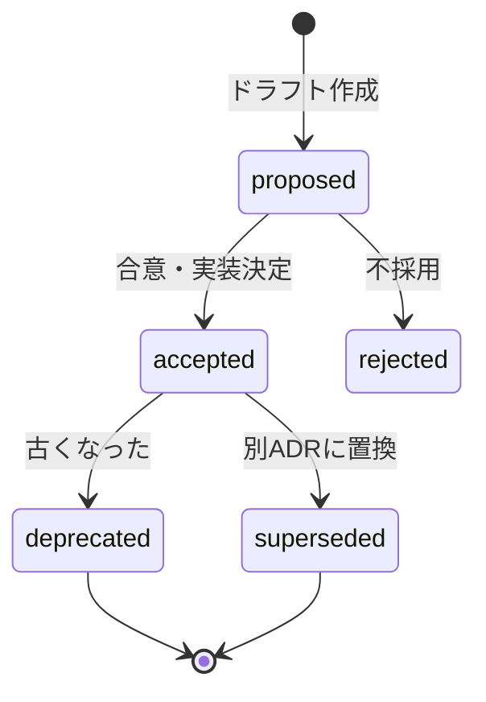

# Architecture Decision Records (ADR)

このディレクトリには、本プロジェクトの **アーキテクチャ上の意思決定** を [MADR](https://adr.github.io/madr/) 形式で記録します。

## ADR とは

> An ADR is a document that captures an important architectural decision made along with its context and consequences.
> — Michael Nygard

ライブラリの選定、システム構成の変更、データモデル設計など、**後から「なぜそうしたのか」を辿りたい意思決定** を残します。

## いつ書くか

- 新しい技術を導入する（例: Prisma の採用、Vitest への移行）
- アーキテクチャパターンを選ぶ（例: モノリス → モジュラーモノリス）
- 重要なトレードオフを伴う設計判断
- 廃止・置換する（既存ADRを supersede）

## ファイル命名

```
docs/decisions/NNNN-<kebab-case-title>.md
```

- `NNNN`: 4桁連番（0001 から）
- title: ケバブケース（小文字 + `-` 区切り）

例:
- `0001-record-architecture-decisions.md`
- `0002-use-prisma-for-orm.md`
- `0003-adopt-modular-monolith.md`

## 書き方

[`template.md`](template.md) をコピーして編集してください:

```bash
# Claude Code 内で
/adr "Use Prisma for ORM"

# 手動で
cp docs/decisions/template.md docs/decisions/0002-use-prisma-for-orm.md
```

## Status の遷移



## 既存 ADR 一覧

| # | タイトル | Status | Date |
|---|---------|--------|------|
| [0001](0001-record-architecture-decisions.md) | Record architecture decisions | accepted | 2026-05-16 |
