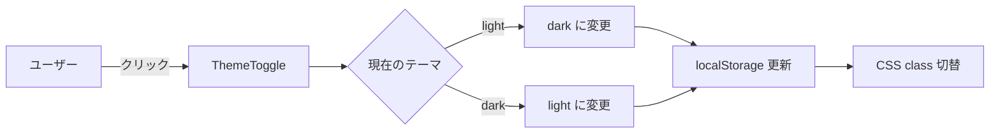

# Spec: <機能名>

- **Issue**: #<番号>
- **Status**: draft | review | approved | implemented | released
- **Owner**: <担当者>
- **Created**: YYYY-MM-DD
- **Related ADR**: [ADR-NNNN](../decisions/NNNN-xxx.md)（あれば）

## Goal

この機能で達成したいことを **1段落** で。

> 例: ユーザーがログイン画面でダークモードを切り替えられるようにし、設定を永続化する。

## Non-Goals

明示的にやらないこと:

- <例: 他のページのテーマ切替（今回はログイン画面のみ）>
- <例: システム設定との同期（ユーザー手動切替のみ）>

## User Stories

```
As a <user>
I want to <action>
So that <benefit>
```

例:
- As a **新規ユーザー**, I want to **暗いテーマを選択** to **目の疲れを減らす**
- As a **戻ってきたユーザー**, I want to **前回の設定を覚えていてほしい** to **毎回設定し直さなくて済む**

## Acceptance Criteria

検証可能な条件:

- [ ] ログイン画面右上にテーマ切替ボタンが表示される
- [ ] クリックすると light ↔ dark が切り替わる
- [ ] 設定は localStorage に保存される
- [ ] ページリロード後も設定が維持される
- [ ] WAI-ARIA 準拠（`aria-label` 付き、キーボード操作可）

## Design

### UI

<スクショ、Figma リンク、Mermaid 図など>



### Data Model

<必要なら DB スキーマ、API スキーマ、TypeScript の型など>

```typescript
type Theme = 'light' | 'dark';
type ThemePreference = {
  current: Theme;
  setBy: 'user' | 'system';
  updatedAt: Date;
};
```

### API

<エンドポイント定義、メソッド、レスポンス例>

| Method | Path | Description |
|--------|------|-------------|
| GET | `/api/user/preferences` | 設定取得 |
| PATCH | `/api/user/preferences` | 設定更新 |

## Edge Cases

- localStorage が無効化されている場合 → セッションストレージで代替、なければ毎回 light
- システムのダークモード設定がある場合 → 初回のみ尊重、ユーザー手動切替後はそれを優先
- 複数タブ同時操作 → `storage` イベントで同期

## Test Plan

E2E:
- [ ] light → dark 切替が反映される
- [ ] リロード後も維持される
- [ ] localStorage クリア時にデフォルト（light）に戻る

ユニット:
- [ ] ThemeToggle コンポーネント
- [ ] useTheme フック

## Implementation Notes

- 既存パターン: `src/hooks/useLocalStorage.ts` を流用
- 影響範囲: `src/components/LoginPage.tsx`, `src/hooks/useTheme.ts`
- 見積もり: 3時間

## Rollout

- フラグ: なし（直接リリース）
- 段階: PR → main マージ → 次回リリース
- ロールバック: revert のみで戻せる
