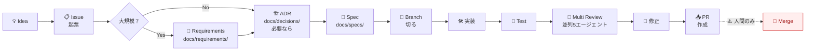

# Document-Driven Development (DocDD)

このテンプレは **DocDD（Document-Driven Development）** を実践します。コードを書く前に **何を・なぜ・どう作るか** を文書化し、AI エージェントが context として読める状態にします。

## 🔄 開発フロー



## 📊 ドキュメント階層

```
docs/
├── requirements/   # 「誰が・なぜ・何が嬉しい」(PdM/企画)
│   └── <topic>.md
├── decisions/      # 「なぜそうするか」(ADR)
│   └── NNNN-xxx.md
├── specs/          # 「どう作るか」(エンジニア)
│   └── <issue#>-<slug>.md
├── architecture/   # システム構造 (C4 Model)
│   ├── c1-system-context.md
│   ├── c2-containers.md
│   └── c3-*.md
└── workflows/      # 開発プロセス
    └── docdd.md (このファイル)
```

各層の **読者** と **粒度**:

| Doc | 読者 | 粒度 | いつ書く |
|-----|------|------|---------|
| Requirements | PM, ステークホルダー, 開発者 | エピック単位 | 大きな新機能 / 方針転換 |
| ADR | 全員（特に未来の開発者） | 技術選定・設計判断単位 | 重要な意思決定 |
| Spec | 開発者, レビュアー | 機能単位 | 実装前 |
| Architecture | 全員 | システム全体 | プロジェクト立ち上げ / 大改修 |

## ⚡ コマンドで自動化

| コマンド | やること |
|---------|---------|
| `/requirements <topic>` | `docs/requirements/<topic>.md` 雛形生成 |
| `/adr <title>` | `docs/decisions/NNNN-<slug>.md` 雛形生成（連番自動） |
| `/spec <issue#>` | `docs/specs/<issue#>-<slug>.md` 雛形生成 |
| `/autopilot <issue#>` | Issue → Spec → 実装 → テスト → レビュー → PR を **一気通貫** |

## 🤖 AI エージェントとの相性

DocDD は AI コーディングエージェント（Claude Code, Codex 等）の **長期記憶** として機能します:

- `docs/decisions/` を読めば「なぜこの技術を選んだか」がわかる
- `docs/specs/<issue#>-*.md` を読めば「この機能で何を作るべきか」がわかる
- `docs/architecture/` を読めば「全体の構造」がわかる
- → エージェントが矛盾する提案をしない

CLAUDE.md / AGENTS.md からは:

```markdown
重要な意思決定は docs/decisions/ を参照。
機能仕様は docs/specs/<issue#>-*.md を参照。
```

と書いておくと、Claude/Codex が自動的に context として読みます。

## ⚠️ Merge は人間専用

このテンプレでは **AI エージェントによる Merge を3層で禁止** しています:

| 層 | 実装 |
|----|------|
| Layer 1: CLAUDE.md / AGENTS.md | "IMPORTANT: Claude/Codex は PR を Merge しません" |
| Layer 2: settings.json `permissions.deny` | `Bash(gh pr merge *)`, `Bash(git merge *)`, `Bash(git push origin main)` 等 |
| Layer 3: PreToolUse hook (`block-merge.sh`) | 上記コマンドを動的に検知してブロック |

理由:
- Merge は **本番反映の最後の砦**。人間の最終承認が必要
- AI が誤って main を破壊するリスクを排除
- PR レビューは AI、Merge ボタンは人間、の役割分担を徹底

ただし以下は許可:
- ✅ PR 作成 (`gh pr create`)
- ✅ PR コメント、レビュー投稿
- ✅ feature ブランチへの push
- ✅ ローカルでの rebase（push 前）

## 📈 段階的な導入

最初から全部やる必要はありません:

| 段階 | やること |
|------|---------|
| **L1: 軽量** | Issue + Conventional Commits + PR テンプレ のみ |
| **L2: 標準** | + Spec (docs/specs/) |
| **L3: 充実** | + ADR (docs/decisions/) |
| **L4: フル** | + Requirements + Architecture + `/autopilot` |

L4 でやっと真の DocDD。**L2 から始めて段階的に育てる** のが現実的。
